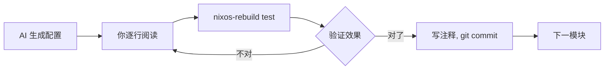

## 当前磁盘布局（参考）

```
nvme0n1     953.9G
├─nvme0n1p1   260M  EFI (Windows)
├─nvme0n1p2    16M  MSR
├─nvme0n1p3 199.2G  Windows C:    ntfs
├─nvme0n1p4   797M  Recovery
├─nvme0n1p5 405.2G  Windows D:    ntfs    ← 从这里缩 80G
├─nvme0n1p6   512M  /boot         vfat    ← 共用 EFI 分区
├─nvme0n1p7    20G  swap          swap    ← 共用 swap
└─nvme0n1p8 327.9G  @ + @home     btrfs   ← /home 数据在这
                    目标新分区 →  nvme0n1p9  80G  NixOS /
```

---

## 一、备份

```bash
# 1. 导出包列表（供 AI 生成 nix 配置参考）
pacman -Qe > ~/dotfiles/pkglist.txt

# 2. 备份关键系统信息
cp /etc/fstab ~/dotfiles/
lsblk -o NAME,SIZE,FSTYPE,MOUNTPOINT,UUID > ~/dotfiles/disk-layout.txt
sudo efibootmgr > ~/dotfiles/efi-entries.txt

# 3. push dotfiles（核心资产）
cd ~/dotfiles && git add -A && git commit -m "pre-nixos backup" && git push

# 4. 外部硬盘全量备份（强烈建议）
rsync -avh --progress /home/calendar/ /mnt/backup-home/
```

> `/home` 在 btrfs 子卷 `@home` 上，安装 NixOS 时只 mount 不格式化，数据原封不动。但备份永远不嫌多。

---

## 二、Windows 划分空闲分区

1. 进 Windows，右键开始菜单 → **磁盘管理**
2. 右键 D 盘（405G） → **压缩卷**
3. 输入 `81920`（= 80G），完成后出现"未分配"区域

> **对 Arch 完全不影响。** 动的只是 D 盘尾部空间，Linux 分区编号不变。新分区会排到 nvme0n1p9。

---

## 三、提前准备（趁现在！）

在 Arch 里用代理下好这些文件，存到 U 盘。ISO 环境里再下载很麻烦：

| 文件 | 下载链接 | 用途 |
|------|----------|------|
| NixOS ISO | [graphical ISO](https://nixos.org/download) | 安装镜像 |
| mihomo 内核 | [mihomo/releases](https://github.com/MetaCubeX/mihomo/releases) `mihomo-linux-amd64-*.gz` | 代理客户端 |
| Country.mmdb | [Country.mmdb](https://github.com/Dreamacro/maxmind-geoip/releases/latest/download/Country.mmdb) | GEOIP 分流 |

Ventoy 做 U 盘：[ventoy.net](https://www.ventoy.net/) — 把 ISO 拖进去就行，不用反复烧录。

---

## 四、NixOS 安装

### 4.1 分区

ISO 启动后开终端，创建 nvme0n1p9：

```bash
sudo cfdisk /dev/nvme0n1   # 选空白空间 → New → 80G → Write
sudo mkfs.ext4 /dev/nvme0n1p9
```

挂载：

```bash
sudo mount /dev/nvme0n1p9 /mnt
sudo mkdir -p /mnt/boot
sudo mount /dev/nvme0n1p6 /mnt/boot     # 共用 EFI，不格式化
sudo mkdir -p /mnt/home
sudo mount /dev/nvme0n1p8 /mnt/home     # 共用 /home，不格式化
sudo swapon /dev/nvme0n1p7
```

### 4.2 代理（关键步骤）

> 图形安装器 `calamares` 不会走 systemd 或 nix-daemon 的代理配置。必须用 `sudo -E` 注入环境变量。

解压 mihomo，把 `Country.mmdb` 放同目录。创建 `config.yaml`（改订阅链接）：

```yaml
mixed-port: 7890
allow-lan: true
mode: rule
log-level: info
external-controller: :9090

proxy-providers:
  airport:
    type: http
    url: "你的订阅链接"
    interval: 3600
    path: ./airport.yaml
    health-check:
      enable: true
      interval: 600
      url: http://www.gstatic.com/generate_204

proxy-groups:
  - name: 🚀 节点选择
    type: select
    use:
      - airport

rules:
  - GEOIP,CN,DIRECT
  - MATCH,🚀 节点选择
```

终端 1：

```bash
chmod +x ./mihomo
./mihomo -d .
```

终端 2：

```bash
export http_proxy=http://127.0.0.1:7890
export https_proxy=http://127.0.0.1:7890
sudo -E calamares
```

终端 1 出现请求日志就说明代理通了。然后走图形安装流程即可。

### 4.3 安装注意事项

- 分区选择时确认 `/mnt`、`/mnt/boot`、`/mnt/home` 挂载正确
- 用户名为 `calendar`（和 Arch 一致，保证 UID 1000）
- 桌面环境先选最简（甚至不选），装完再声明式加——避免 ISO 下载过多包
- 图形安装器只能选 systemd-boot，**没关系**，装完再切 GRUB（见下一步）

---

## 五、启动项：让 Arch GRUB 统一引导

### 5.1 装完首次启动

图形安装器默认装的是 systemd-boot。重启后 BIOS 启动菜单（F12）会多出"NixOS"选项。先进 NixOS。

### 5.2 在 NixOS 里切换为 GRUB

```nix
# 编辑 /etc/nixos/configuration.nix（或 flake.nix）
boot.loader = {
  grub.enable = true;
  grub.device = "nodev";              # EFI 模式
  grub.efiSupport = true;
  efi.canTouchEfiVariables = true;
  efi.efiSysMountPoint = "/boot";
};
```

```bash
sudo nixos-rebuild switch
```

此时 NixOS 的 GRUB 写入了 `/EFI/NixOS-boot/`，和 Arch 的 `/EFI/ARCH/` 互不冲突。

### 5.3 回到 Arch，让 Arch GRUB 纳管全部系统

```bash
# 进 Arch
# 确保 os-prober 可用
sudo pacman -S os-prober --needed

# 修改 /etc/default/grub，取消注释：
# GRUB_DISABLE_OS_PROBER=false

# 重新生成
sudo grub-mkconfig -o /boot/grub/grub.cfg
```

重启后，Arch GRUB 菜单会出现三项：

```
Arch Linux
NixOS
Windows Boot Manager
```

> 两个 GRUB 实例和平共处，不打架。等确认不再回 Arch 后，可以删掉 `/EFI/ARCH/` 回收空间。

---

## 六、AI 辅助配置

装完系统后，把 `~dotfiles/pkglist.txt` 和硬件信息给 AI，让它生成第一版 `flake.nix`。

**保持掌控感的策略：**



1. AI 生成 → 你逐行读，不懂的查 [nixos.wiki](https://nixos.wiki)
2. 用 `nixos-rebuild test`（重启还原）而不是 `switch`，放心实验
3. 把理解写到注释里，`flake.nix` 就是你的学习笔记
4. 逐步接管：先让 AI 写 `services`，看懂后自己改 `networking`
5. 仓库路径：`~/code/nixos/`，git 管理

---

## 七、过渡期 & 清理

- **日常使用 NixOS**，`/home` 共享，资料无缝衔接
- 遇到问题想回 Arch？重启选 Arch 即可，零成本
- **确认无痛点后**（1-2 周），清理 Arch：
  ```bash
  # 进 NixOS，删掉 Arch 的 btrfs 子卷
  sudo mount /dev/nvme0n1p8 /mnt
  sudo btrfs subvolume delete /mnt/@
  # 空间还给 NixOS 根分区或数据分区
  ```
- 清理 `/home` 下不再需要的 Arch 遗留 config：
  ```bash
  ncdu ~/.config    # 交互式浏览，按需删
  ```

---

## 八、常见坑

**Q: 图形安装器选不到 GRUB？**
A: 正常。先用 systemd-boot 装完，`nixos-rebuild switch` 改一行就切 GRUB 了。见第五章。

**Q: `/home` 共享会冲突吗？**
A: 短期不会。同一 UID 1000，绝大多数 dotfile 是跨发行版通用的。GNOME/GTK 组件新版会静默迁移旧配置。

**Q: 安装时网络不通？**
A: 确认 `sudo -E calamares` 而不是直接 `calamares`。`-E` 是唯一的代理环境变量传递方式。

**Q: 能不能直接 `nixos-anywhere` 把 Arch 变 NixOS？**
A: 不能。你的 `/` 和 `/home` 在同一分区不同子卷，格式化根分区会连带毁掉 `/home`。等以后 `/home` 独立分区了可以用。
